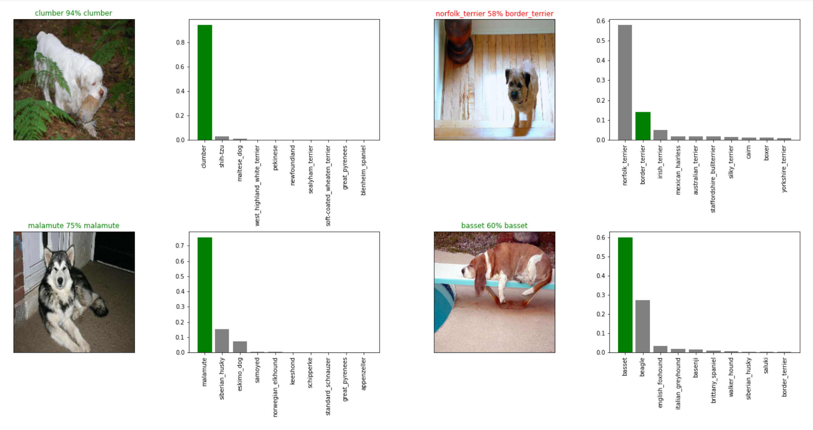

# Dog Breed Classifier

**Name:** Dog Breed Classifier

**Author:** Sharome Burton

**Date:** 07/20/2021

**Description:** Machine learning model used to determine the breed of a dog from a given image.

**Kaggle:** https://www.kaggle.com/sharomeethan/dog-breed-classifier

**Colab:** https://colab.research.google.com/drive/1wLBBuwKx4a9w3jTectO0nzCzU9d3w_BB?usp=sharing

## 1. Problem definition
> How well can we identify the breed of a dog from a given image?

## 2. Data
We are provided with a training set and a test set of images of dogs. Each image has a filename that is its unique `id`. The dataset comprises 120 breeds of dogs.
   
* `train.zip` - the training set, we are provided the breed for these dogs
* `test.zip` - the test set, we must predict the probability of each breed for each image
* `sample_submission.csv` - a sample submission file in the correct format
* `labels.csv` - the breeds for the images in the train set

There are 10,000+ labeled images in each set.
    
source: https://www.kaggle.com/c/dog-breed-identification/data

## 3. Features

   * `id` - a unique identifier for each image
   * `breed` - the breed of the dog, eg. 
    * affenpinscher
    * afghan_hound
    * african_hunting_dog
    * airedale
    * american_staffordshire_terrier 
   
## 4. Evaluation 

> **Goal:** Determine the breed of a dog in a given image with >75% accuracy.

The evaluation is a file with prediction probabilities for each dog breed of each test image. Submissions are evaluated on Multi Class Log Loss between the predicted probability and the observed target.

source: https://www.kaggle.com/c/dog-breed-identification/overview/evaluation

